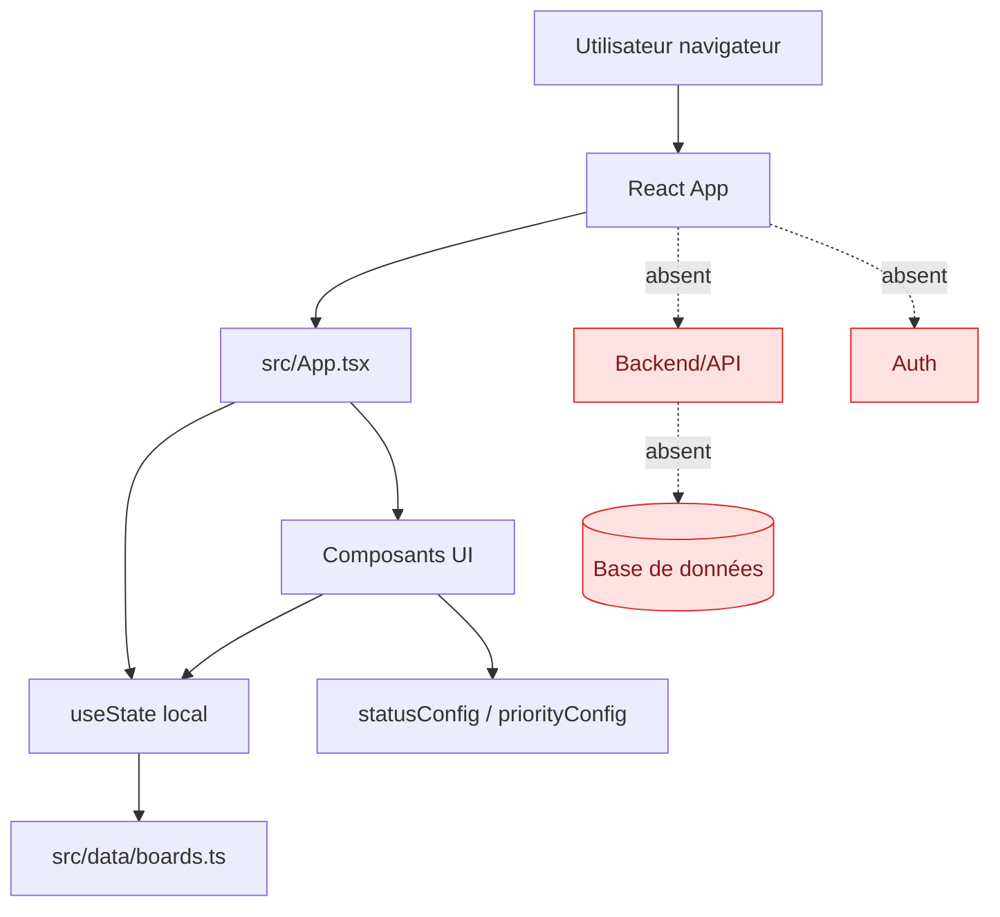
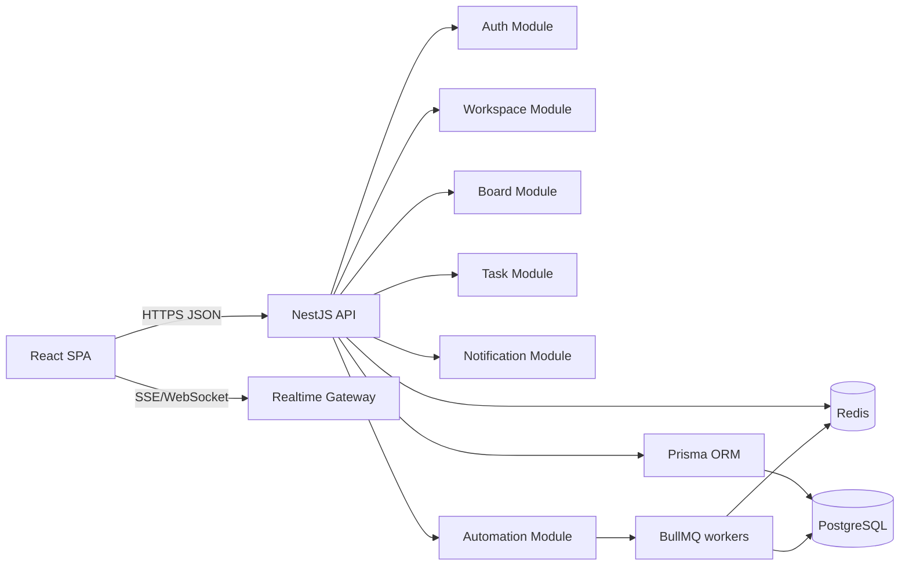
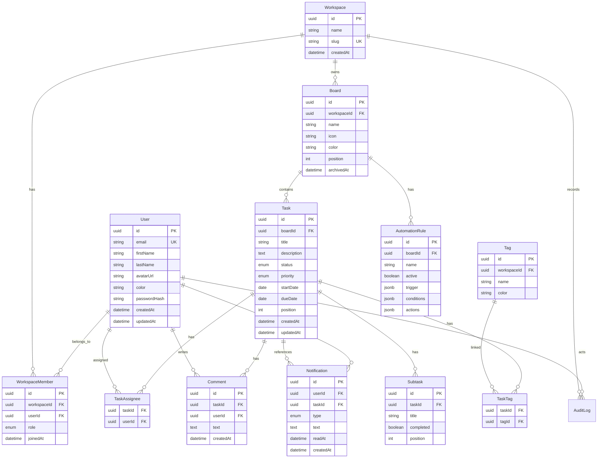

# Rapport d’audit et plan de finalisation — `CouLiBaLy-B/agility`

> Date d’audit : 2026-06-13 — commit audité : `aa58387cdf09282b77199afc76f68030b4096a85`  
> Repository : <https://github.com/CouLiBaLy-B/agility.git>

## Synthèse exécutive

L’application est un **frontend React/Vite/Tailwind** de gestion de projets et tâches, inspiré d’un outil type Monday/Trello : tableaux, vue table, Kanban, timeline, dashboard, équipe, notifications, paramètres et automatisations.

Constat majeur : **il n’existe aucun backend, aucune API, aucune base de données et aucune authentification réelle**. Toutes les données métier sont embarquées côté client via `src/data/boards.ts` et divers composants hardcodent des profils, libellés, emails, états UI et données de démonstration. Les mutations sont uniquement en mémoire React : elles disparaissent au rechargement.

### Criticités principales

| Criticité | Sujet | Impact |
|---|---|---|
| 🔴 Haute | Données mockées et absence de persistance | Application non exploitable en production |
| 🔴 Haute | Absence totale d’authentification / autorisation | Pas d’isolation utilisateurs, pas de RBAC |
| 🔴 Haute | Vulnérabilités npm sur Vite/esbuild et plugins liés | Risque supply-chain/dev-server selon contexte |
| 🟡 Moyenne | Nombreuses actions UI non fonctionnelles | UX trompeuse : boutons sans effet, paramètres non sauvegardés |
| 🟡 Moyenne | Accessibilité incomplète | Boutons iconiques sans `aria-label`, drag-and-drop souris uniquement |
| 🟡 Moyenne | Architecture frontend monolithique | Couplage fort aux mocks, difficile à brancher à une API |

---

# Phase 1 — Clonage, exploration et architecture actuelle

## Commandes exécutées

```bash
git clone https://github.com/CouLiBaLy-B/agility.git
cd agility
npm install
npm run build
npx tsc --noEmit --pretty false
npm audit --json
npm outdated --json
npx depcheck --json
```

Résultats :

- `npm run build` : ✅ succès après `npm install`.
- TypeScript strict : ✅ `tsc --noEmit` sans erreur.
- Audit npm : ❌ 5 vulnérabilités hautes.
- Backend/API/BDD : ❌ non présents.

## Arborescence pertinente

```text
agility/
├── index.html
├── package.json
├── package-lock.json
├── tsconfig.json
├── vite.config.ts
└── src/
    ├── App.tsx
    ├── main.tsx
    ├── index.css
    ├── data/
    │   └── boards.ts
    ├── utils/
    │   └── cn.ts
    └── components/
        ├── Automations.tsx
        ├── Avatar.tsx
        ├── BoardView.tsx
        ├── Dashboard.tsx
        ├── Header.tsx
        ├── Inbox.tsx
        ├── KanbanView.tsx
        ├── People.tsx
        ├── PriorityBadge.tsx
        ├── Settings.tsx
        ├── Sidebar.tsx
        ├── StatusBadge.tsx
        ├── TaskModal.tsx
        └── TimelineView.tsx
```

## Stack technique identifiée

| Couche | Technologie |
|---|---|
| Frontend | React `19.2.6` |
| Build | Vite `7.3.2` |
| Langage | TypeScript `5.9.3` |
| Styling | Tailwind CSS `4.1.17`, classes utilitaires |
| Animations | Framer Motion `12.40.0` |
| Icônes | `lucide-react` |
| Dates | `date-fns` |
| Bundling single-file | `vite-plugin-singlefile` |
| Backend | Aucun |
| Base de données | Aucune |
| Authentification | Aucune |
| Tests | Aucun framework configuré |
| Lint/format | Aucun ESLint/Prettier configuré |

## Architecture actuelle



### Flux actuel

1. `src/main.tsx` monte `<App />`.
2. `App.tsx` initialise `boards` depuis `src/data/boards.ts`.
3. Toutes les actions utilisateur modifient l’état React local : création de board, création de tâche, changement statut/priorité, commentaires, sous-tâches.
4. Aucune donnée n’est sauvegardée hors mémoire.
5. Aucune requête réseau (`fetch`, `axios`, client API) n’est utilisée.

---

# Phase 2 — Audit complet

## 2.1 Audit fonctionnel

### Fonctionnalités existantes

| Fonctionnalité | Statut | Criticité | Observations |
|---|---:|---|---|
| Dashboard global | ✅ Partiel | 🟢 Basse | Agrège les tâches mockées : statuts, priorités, taux de complétion, charge équipe. |
| Sidebar avec tableaux | ✅ Partiel | 🟡 Moyenne | Sélection des boards, favoris hardcodés, création de board locale. |
| Vue table | ✅ Partiel | 🟢 Basse | Liste tâches, recherche par titre/tag, changement statut/priorité. |
| Vue Kanban | ✅ Partiel | 🟡 Moyenne | Drag-and-drop par statut ; pas accessible clavier ; pas de persistance. |
| Vue Timeline | ✅ Partiel | 🟡 Moyenne | Timeline mensuelle basée sur dates mockées ; bouton “Today” fixé à avril 2026. |
| Modal tâche | ✅ Partiel | 🟡 Moyenne | Consultation, statut/priorité, check subtasks, ajout commentaire local. Pas édition titre/description/dates/assignees. |
| Inbox notifications | ✅ Démo | 🔴 Haute | Notifications statiques, pas de lecture persistée ni pagination. |
| People/team | ✅ Démo | 🔴 Haute | Utilisateurs statiques, emails générés fictivement. |
| Settings | ⚠️ UI seulement | 🟡 Moyenne | Champs non sauvegardés, onglets partiellement vides, déconnexion sans effet. |
| Automations | ⚠️ Démo | 🟡 Moyenne | Recettes statiques toggle local, pas de moteur d’automatisation. |
| Header recherche | ✅ Partiel | 🟢 Basse | Recherche locale sur tâches visibles. |
| Boutons Filter/Share/Help/Settings header | ❌ Non implémenté | 🟡 Moyenne | Boutons sans action. |
| Auth/session | ❌ Absent | 🔴 Haute | Profil courant hardcodé `Sarah Chen` / `u1`. |
| Persistance | ❌ Absente | 🔴 Haute | Perte totale au refresh. |

## 2.2 Audit technique

| Sujet | Criticité | Constat | Recommandation |
|---|---|---|---|
| Couplage aux données statiques | 🔴 Haute | `boards`, `users`, `notifications` importés directement dans les composants. | Introduire couche `services/api`, hooks data, DTOs partagés. |
| Absence backend | 🔴 Haute | Impossible d’avoir multi-utilisateur, permissions, historisation. | Implémenter API + DB + auth. |
| État global dans `App.tsx` | 🟡 Moyenne | Beaucoup de logique métier dans le composant racine. | Extraire stores/hooks : `useBoards`, `useTasks`, `useNotifications`. |
| Mutations non robustes | 🟡 Moyenne | IDs `Date.now()`, pas d’optimistic update contrôlé, pas de gestion erreurs. | IDs serveur UUID, React Query/TanStack Query, rollback. |
| Typage métier minimal | 🟡 Moyenne | Interfaces côté frontend uniquement, pas de validation runtime. | Schémas Zod partagés ou DTO backend générés. |
| Pas de tests | 🔴 Haute | Aucun test unitaire/intégration/e2e. | Vitest + Testing Library + Playwright. |
| Pas de lint/format | 🟡 Moyenne | Qualité dépend seulement de TypeScript. | ESLint flat config + Prettier + lint-staged. |
| UI et logique mélangées | 🟡 Moyenne | Calculs statistiques dans composants UI. | Sélecteurs/services purs testables. |
| Dépendances single-file | 🟢 Basse | `vite-plugin-singlefile` génère un HTML autonome de 434 Ko gzip 131 Ko. | Valider besoin réel ; sinon build classique. |

## 2.3 Audit des données fictives/mockées

### Source principale : `src/data/boards.ts`

| Localisation | Type | Structure | Criticité |
|---|---|---|---|
| `src/data/boards.ts:41-44` | Notifications fictives | `Notification[]` avec `id`, `userId`, `text`, `type`, `date`, `isRead`, `taskId` | 🔴 Haute |
| `src/data/boards.ts:46-52` | Utilisateurs fictifs | `User[]` avec noms, initiales, couleurs, avatars vides | 🔴 Haute |
| `src/data/boards.ts:54-306` | Boards et tâches fictifs | `Board[]` contenant 3 boards, 13 tâches, subtasks, comments, tags, dates | 🔴 Haute |
| `src/data/boards.ts:308-313` | Config statuts | labels/couleurs hardcodés | 🟢 Basse |
| `src/data/boards.ts:315-319` | Config priorités | labels/couleurs hardcodés | 🟢 Basse |

### Données hardcodées dans les composants

| Localisation | Donnée | Criticité |
|---|---|---|
| `src/components/Automations.tsx:4-9` | Recettes d’automatisation statiques dont assignation “Sarah Chen” | 🟡 Moyenne |
| `src/components/Settings.tsx:8-15` | Onglets paramètres statiques | 🟢 Basse |
| `src/components/Settings.tsx:78,86,96` | Profil `Sarah Chen`, email `sarah.chen@company.com` | 🔴 Haute |
| `src/components/Settings.tsx:112-122` | Préférences notifications cochées par défaut | 🟡 Moyenne |
| `src/components/Settings.tsx:132` | Thèmes `light`, `dark`, `system` non persistés | 🟢 Basse |
| `src/components/Sidebar.tsx:113-114` | Workspace `WorkSpace`, équipe `Product Team` | 🔴 Haute |
| `src/components/Sidebar.tsx:155` | Favori `Product Launch Q2` hardcodé | 🟡 Moyenne |
| `src/components/Sidebar.tsx:264-265` | Profil courant `Sarah Chen`, rôle `Admin` | 🔴 Haute |
| `src/components/People.tsx:70` | Emails générés `{name}@company.com` | 🔴 Haute |
| `src/components/TimelineView.tsx:25,66` | Mois courant fixé à avril 2026 | 🟡 Moyenne |
| `src/App.tsx:47` | Nom par défaut `New Board` | 🟢 Basse |
| `src/App.tsx:74-83` | Tâche créée avec valeurs par défaut, assignée `u1` | 🟡 Moyenne |
| `src/App.tsx:179` | `hasUnread={true}` toujours vrai | 🟡 Moyenne |
| `src/components/TaskModal.tsx:54,224` | Commentaires créés par `u1`, avatar `u1` | 🔴 Haute |
| `src/components/Header.tsx:29-33` | Liste de vues statique | 🟢 Basse |
| `src/components/Header.tsx:136-145` | Boutons Filter/Share/More sans état backend | 🟡 Moyenne |
| `src/components/Inbox.tsx:81-83` | Bouton “View all notifications” sans backend | 🟡 Moyenne |

## 2.4 Audit sécurité

| Sujet | Criticité | Constat | Action |
|---|---|---|---|
| Authentification | 🔴 Haute | Aucune auth, utilisateur courant hardcodé. | JWT access/refresh + OAuth2/OIDC optionnel. |
| Autorisation/RBAC | 🔴 Haute | Aucun rôle réel, rôle `Admin` visuel seulement. | RBAC workspace/project/board. |
| Isolation tenant/workspace | 🔴 Haute | Aucune notion de tenant côté données réelles. | Modèle `WorkspaceMember`, scopes par workspace. |
| Gestion secrets | 🟢 Basse | Aucun secret trouvé dans le code. | Ajouter `.env.example`, validation env. |
| Validation input | 🟡 Moyenne | Données contrôlées côté UI, pas de validation serveur. | Zod/class-validator côté API. |
| XSS | 🟢 Basse | React échappe les contenus ; pas de `dangerouslySetInnerHTML`. | Continuer à éviter HTML brut ; sanitizer si markdown. |
| CSRF | 🟡 Moyenne | Pas applicable actuellement, sera pertinent si cookies. | Cookies `SameSite=Lax/Strict`, CSRF si session cookie. |
| CORS/rate limit | 🔴 Haute | Non applicable car backend absent. | Configurer au backend. |
| Dépendances vulnérables | 🔴 Haute | 5 high npm audit. | Mettre à jour Vite/plugins/esbuild. |

## 2.5 Audit dépendances

### Dépendances déclarées

```json
{
  "react": "19.2.6",
  "react-dom": "19.2.6",
  "vite": "7.3.2",
  "@vitejs/plugin-react": "5.1.1",
  "@tailwindcss/vite": "4.1.17",
  "tailwindcss": "4.1.17",
  "vite-plugin-singlefile": "2.3.0"
}
```

### Vulnérabilités `npm audit`

| Package | Sévérité | Cause |
|---|---|---|
| `vite` | high | dépend de versions vulnérables d’`esbuild` |
| `esbuild` | high/low | advisory RCE/supply-chain et file read dev server Windows |
| `@tailwindcss/vite` | high | transitivement via Vite |
| `@vitejs/plugin-react` | high | transitivement via Vite |
| `vite-plugin-singlefile` | high | transitivement via Vite |

Recommandation : tester montée vers versions patch disponibles, puis évaluer Vite 8 si nécessaire.

### Packages obsolètes (`npm outdated`)

| Package | Actuel | Latest | Criticité |
|---|---:|---:|---|
| `react` | 19.2.6 | 19.2.7 | 🟢 Basse |
| `react-dom` | 19.2.6 | 19.2.7 | 🟢 Basse |
| `tailwind-merge` | 3.4.0 | 3.6.0 | 🟢 Basse |

### Packages potentiellement non utilisés

`depcheck` signale `tailwindcss` et `typescript` en devDependencies non utilisées directement, mais ce sont des dépendances d’outillage normales. À conserver.

## 2.6 Audit UX/UI

| Sujet | Criticité | Constat | Recommandation |
|---|---|---|---|
| Cohérence visuelle | 🟢 Basse | UI moderne, cohérente, cards/table/Kanban harmonisés. | Formaliser design tokens. |
| Responsive | 🟡 Moyenne | Grilles responsives, mais sidebar fixe 64/14, table et timeline nécessitent scroll horizontal. | Tester mobile réel, ajouter navigation mobile. |
| Accessibilité boutons iconiques | 🟡 Moyenne | Plusieurs boutons sans `aria-label`. | Ajouter labels accessibles. |
| Drag-and-drop | 🟡 Moyenne | Kanban utilisable souris uniquement. | Alternative clavier + boutons de changement de statut. |
| Contrastes | 🟢/🟡 | Globalement ok, textes gris très clairs parfois faibles. | Audit axe/Lighthouse. |
| Formulaires | 🟡 Moyenne | Labels visuels parfois sans association `htmlFor`. | Relier labels/inputs, états erreur. |
| Feedback actions | 🟡 Moyenne | Pas de toast/loading/error, boutons sans effet. | Ajouter feedback systématique. |

---

# Phase 3 — Plan de suppression des données fictives

## Mapping mock → source réelle → stratégie

| Mock | Localisation | Structure | Source de remplacement | Stratégie migration |
|---|---|---|---|---|
| Utilisateurs | `src/data/boards.ts:46-52`, `Avatar.tsx`, `People.tsx`, `Sidebar.tsx`, `Settings.tsx` | `User { id,name,avatar,initials,color }` | API `/users`, `/me`, DB `users`, `workspace_members` | Créer modèle User, remplacer imports directs par `useCurrentUser()` et `useWorkspaceMembers()`. |
| Boards | `src/data/boards.ts:54-306` | `Board { id,name,icon,color,tasks[] }` | API `/workspaces/:id/boards` | Charger par workspace, conserver champs `icon/color` pour rétrocompatibilité. |
| Tasks | `src/data/boards.ts:60-304`, `App.tsx:70-84` | `Task { title,status,priority,assignees,dueDate,startDate,tags,description,subtasks,comments }` | API `/boards/:id/tasks` | Normaliser en tables `tasks`, `task_assignees`, `task_tags`, `subtasks`, `comments`. |
| Notifications | `src/data/boards.ts:41-44`, `Inbox.tsx` | `Notification[]` | API `/notifications`, WebSocket/SSE | Générer à partir événements domaine, persister `readAt`. |
| Commentaires | `src/data/boards.ts` comments + `TaskModal.tsx:54` | `{ id,userId,text,date }` | API `/tasks/:id/comments` | Remplacer `Date.now` et `u1` par utilisateur auth côté serveur. |
| Sous-tâches | `src/data/boards.ts` subtasks | `{ id,title,completed }` | API `/tasks/:id/subtasks` | CRUD dédié ou nested update transactionnel. |
| Statuts/priorités | `src/data/boards.ts:308-319` | Config front | Option 1 constants versionnées ; option 2 table `task_statuses` | Garder constants au départ pour compatibilité ; exposer `/metadata`. |
| Automations | `Automations.tsx:4-9` | `{ id,text,active }` | API `/boards/:id/automations` | Modèle règles : trigger/action/conditions JSONB ; moteur async. |
| Workspace/équipe | `Sidebar.tsx:113-114` | texte | API `/workspaces/current` | Introduire sélecteur workspace et membres. |
| Profil courant | `Settings.tsx`, `Sidebar.tsx`, `TaskModal.tsx` | `Sarah Chen`, `u1` | API `/auth/me` | Contexte AuthProvider. |
| Préférences | `Settings.tsx:112-132` | toggles/thème | API `/me/preferences` | Persist user settings, sync localStorage temporaire possible. |
| Timeline today | `TimelineView.tsx:25,66` | `new Date(2026,3,1)` | Date système ou préférence utilisateur | Initialiser à `new Date()`, adapter filtres. |

## Migration frontend incrémentale recommandée

1. Créer `src/api/client.ts` avec base URL `VITE_API_URL`.
2. Installer TanStack Query pour cache/retry/loading.
3. Remplacer `initialBoards` par `useBoards(workspaceId)`.
4. Remplacer imports `users` par `useWorkspaceMembers`.
5. Remplacer `notifications` par `useNotifications`.
6. Conserver temporairement `boards.ts` en fallback dev uniquement :

```ts
const useMockData = import.meta.env.VITE_USE_MOCKS === 'true';
```

---

# Phase 4 — Plan d’implémentation backend

## 4.1 Choix technologiques justifiés

| Besoin | Choix recommandé | Justification |
|---|---|---|
| Framework API | **NestJS** avec Fastify | TypeScript natif, architecture modulaire, DI, OpenAPI facile, cohérent avec frontend TS. |
| Base de données | **PostgreSQL 16+** | Données relationnelles : users/workspaces/boards/tasks/permissions ; JSONB utile pour automations. |
| ORM | **Prisma** | Migrations robustes, typage TS, productivité. Alternative : Drizzle si besoin plus SQL-first. |
| Auth | JWT access court + refresh token rotatif ; OAuth2/OIDC optionnel | Compatible SPA, extensible SSO. |
| Cache/queue | Redis + BullMQ | Cache notifications/metadata, rate limit, jobs automations/email. |
| Validation | Zod ou class-validator | Validation DTO + OpenAPI. |
| Docs API | Swagger/OpenAPI généré | Contrat frontend/backend. |
| Tests | Vitest/Jest + Supertest + Testcontainers | Tests unitaires et intégration DB réalistes. |
| Temps réel | WebSocket Gateway ou SSE | Notifications live et collaboration future. |

## 4.2 Architecture backend cible



## 4.3 Modélisation des données

### ERD Mermaid



### Exemple Prisma initial

```prisma
enum TaskStatus {
  done
  working
  stuck
  not_started
}

enum TaskPriority {
  high
  medium
  low
}

enum WorkspaceRole {
  owner
  admin
  member
  viewer
}

model Task {
  id          String       @id @default(uuid()) @db.Uuid
  boardId     String       @db.Uuid
  board       Board        @relation(fields: [boardId], references: [id], onDelete: Cascade)
  title       String
  description String       @default("")
  status      TaskStatus   @default(not_started)
  priority    TaskPriority @default(medium)
  startDate   DateTime?    @db.Date
  dueDate     DateTime?    @db.Date
  position    Int          @default(0)
  assignees   TaskAssignee[]
  subtasks    Subtask[]
  comments    Comment[]
  tags        TaskTag[]
  createdAt   DateTime     @default(now())
  updatedAt   DateTime     @updatedAt

  @@index([boardId, status])
  @@index([dueDate])
}
```

## 4.4 API REST proposée

Convention : tous les endpoints sauf login/register nécessitent `Authorization: Bearer <accessToken>`.

### Auth

| Méthode | Endpoint | Description |
|---|---|---|
| POST | `/auth/register` | Créer compte + workspace initial optionnel |
| POST | `/auth/login` | Connexion email/password |
| POST | `/auth/refresh` | Rotation refresh token |
| POST | `/auth/logout` | Révoquer refresh token |
| GET | `/auth/me` | Profil courant, rôles, workspaces |
| POST | `/auth/forgot-password` | Demande reset |
| POST | `/auth/reset-password` | Reset mot de passe |

### Workspaces & membres

| Méthode | Endpoint | Description |
|---|---|---|
| GET | `/workspaces` | Liste des workspaces accessibles |
| POST | `/workspaces` | Créer workspace |
| GET | `/workspaces/:workspaceId` | Détail workspace |
| PATCH | `/workspaces/:workspaceId` | Modifier workspace |
| DELETE | `/workspaces/:workspaceId` | Archiver/supprimer |
| GET | `/workspaces/:workspaceId/members` | Membres |
| POST | `/workspaces/:workspaceId/invitations` | Inviter membre |
| PATCH | `/workspaces/:workspaceId/members/:userId` | Modifier rôle |
| DELETE | `/workspaces/:workspaceId/members/:userId` | Retirer membre |

### Boards

| Méthode | Endpoint | Description |
|---|---|---|
| GET | `/workspaces/:workspaceId/boards` | Liste boards |
| POST | `/workspaces/:workspaceId/boards` | Créer board |
| GET | `/boards/:boardId` | Détail board |
| PATCH | `/boards/:boardId` | Modifier nom/icône/couleur/position |
| DELETE | `/boards/:boardId` | Archiver board |
| POST | `/boards/:boardId/duplicate` | Dupliquer board |

### Tasks

| Méthode | Endpoint | Query/body | Description |
|---|---|---|---|
| GET | `/boards/:boardId/tasks` | `status`, `priority`, `assigneeId`, `q`, `page`, `limit` | Liste tâches filtrée |
| POST | `/boards/:boardId/tasks` | `CreateTaskDto` | Créer tâche |
| GET | `/tasks/:taskId` | — | Détail tâche |
| PATCH | `/tasks/:taskId` | `UpdateTaskDto` | Modifier tâche |
| DELETE | `/tasks/:taskId` | — | Supprimer/archiver tâche |
| PATCH | `/tasks/:taskId/status` | `{ status }` | Changer statut |
| PATCH | `/tasks/:taskId/priority` | `{ priority }` | Changer priorité |
| PUT | `/tasks/:taskId/assignees` | `{ userIds: string[] }` | Remplacer assignés |
| POST | `/tasks/:taskId/assignees/:userId` | — | Ajouter assigné |
| DELETE | `/tasks/:taskId/assignees/:userId` | — | Retirer assigné |
| PUT | `/boards/:boardId/tasks/reorder` | `{ orderedTaskIds }` | Réordonner |

### Subtasks

| Méthode | Endpoint | Description |
|---|---|---|
| POST | `/tasks/:taskId/subtasks` | Ajouter sous-tâche |
| PATCH | `/subtasks/:subtaskId` | Modifier titre/completed/position |
| DELETE | `/subtasks/:subtaskId` | Supprimer |

### Comments

| Méthode | Endpoint | Description |
|---|---|---|
| GET | `/tasks/:taskId/comments` | Liste paginée |
| POST | `/tasks/:taskId/comments` | Ajouter commentaire |
| PATCH | `/comments/:commentId` | Modifier son commentaire |
| DELETE | `/comments/:commentId` | Supprimer selon droits |

### Tags

| Méthode | Endpoint | Description |
|---|---|---|
| GET | `/workspaces/:workspaceId/tags` | Liste tags |
| POST | `/workspaces/:workspaceId/tags` | Créer tag |
| PATCH | `/tags/:tagId` | Modifier tag |
| DELETE | `/tags/:tagId` | Supprimer tag |

### Notifications

| Méthode | Endpoint | Description |
|---|---|---|
| GET | `/notifications` | Liste notifications utilisateur |
| GET | `/notifications/unread-count` | Nombre non lues |
| PATCH | `/notifications/:id/read` | Marquer lue |
| PATCH | `/notifications/read-all` | Tout marquer lu |

### Automations

| Méthode | Endpoint | Description |
|---|---|---|
| GET | `/boards/:boardId/automations` | Liste règles |
| POST | `/boards/:boardId/automations` | Créer règle |
| PATCH | `/automations/:ruleId` | Modifier règle/activer |
| DELETE | `/automations/:ruleId` | Supprimer règle |
| POST | `/automations/:ruleId/test` | Tester règle |

### Analytics

| Méthode | Endpoint | Description |
|---|---|---|
| GET | `/workspaces/:workspaceId/dashboard` | Stats globales dashboard |
| GET | `/workspaces/:workspaceId/workload` | Charge équipe |
| GET | `/boards/:boardId/timeline` | Tâches pour timeline |

### Exemple de réponses compatibles frontend

```json
{
  "id": "b1",
  "name": "Product Launch Q2",
  "icon": "rocket",
  "color": "#E2445C",
  "tasks": [
    {
      "id": "t1",
      "title": "Finalize product roadmap",
      "status": "done",
      "priority": "high",
      "assignees": ["u1", "u2"],
      "dueDate": "2026-04-15",
      "startDate": "2026-03-20",
      "tags": ["Planning", "Strategy"],
      "description": "...",
      "subtasks": [],
      "comments": []
    }
  ]
}
```

## 4.5 OpenAPI / Swagger

À générer automatiquement via NestJS :

```ts
const config = new DocumentBuilder()
  .setTitle('Agility API')
  .setDescription('Project and task management API')
  .setVersion('1.0.0')
  .addBearerAuth()
  .build();
const document = SwaggerModule.createDocument(app, config);
SwaggerModule.setup('/docs', app, document);
```

## 4.6 Sécurité backend

| Contrôle | Implémentation |
|---|---|
| Auth | JWT access 15 min + refresh 7/30 jours hashé en DB |
| Password | Argon2id, politique longueur/complexité raisonnable |
| RBAC | Guards NestJS : `owner/admin/member/viewer` par workspace |
| Validation | DTO + Zod/class-validator, whitelist, transform false par défaut |
| Rate limit | `@nestjs/throttler` + Redis store : login strict, API modéré |
| CORS | Origines depuis env, credentials selon stratégie token |
| CSRF | Si refresh en cookie httpOnly : SameSite + token CSRF sur endpoints state-changing |
| Headers | Helmet : CSP adaptée, HSTS en prod, no-sniff |
| Secrets | `.env`, pas de secrets en repo, validation env au boot |
| Audit | `audit_logs` pour changements sensibles |

## 4.7 Tests

| Niveau | Outils | Cible |
|---|---|---|
| Unitaires frontend | Vitest + Testing Library | 70% composants/hooks critiques |
| Unitaires backend | Vitest/Jest | 80% services/guards |
| Intégration API | Supertest + Testcontainers PostgreSQL/Redis | endpoints critiques auth/boards/tasks |
| E2E | Playwright | parcours login → board → tâche → commentaire → notification |
| Accessibilité | axe-core/Playwright | pages principales sans violation critique |
| Couverture globale cible | — | 80% backend, 70% frontend initial |

## 4.8 DevOps

### Docker compose local

```yaml
services:
  api:
    build: ./apps/api
    env_file: .env
    ports: ["3000:3000"]
    depends_on: [postgres, redis]
  web:
    build: ./apps/web
    ports: ["5173:80"]
  postgres:
    image: postgres:16-alpine
    environment:
      POSTGRES_DB: agility
      POSTGRES_USER: agility
      POSTGRES_PASSWORD: agility_dev
    ports: ["5432:5432"]
  redis:
    image: redis:7-alpine
    ports: ["6379:6379"]
```

### CI/CD GitHub Actions

Pipeline recommandé :

1. Install dépendances via `npm ci`.
2. Lint + typecheck.
3. Tests unitaires.
4. Tests intégration avec services Postgres/Redis.
5. Build frontend et backend.
6. Audit dépendances/SBOM.
7. Build image Docker.
8. Déploiement staging automatique, production manuel avec approbation.

---

# Phase 5 — Roadmap d’exécution

## Priorisation MoSCoW

- **Must** : indispensable production minimale.
- **Should** : important mais contournable temporairement.
- **Could** : amélioration utile.
- **Won’t now** : hors périmètre initial.

## Sprints proposés

### Sprint 0 — Stabilisation audit/outillage — 3 à 5 jours

| Tâche | Estimation | Priorité | Dépendances | Critères de validation |
|---|---:|---|---|---|
| Ajouter ESLint/Prettier | 0.5 j | Must | aucune | `npm run lint` passe |
| Corriger vulnérabilités npm | 0.5-1 j | Must | tests build | `npm audit` sans high exploitable |
| Ajouter Vitest + Testing Library | 1 j | Must | aucune | 5 tests smoke passent |
| Ajouter `.env.example` et config `VITE_API_URL` | 0.5 j | Must | aucune | build local/staging configurable |
| Documenter scripts README | 0.5 j | Should | aucune | onboarding reproductible |

### Sprint 1 — Backend socle auth/workspaces — 1 à 2 semaines

| Tâche | Estimation | Priorité | Dépendances | Critères de validation |
|---|---:|---|---|---|
| Init NestJS + Prisma + PostgreSQL | 1 j | Must | Sprint 0 | API démarre, migration initiale |
| Modèles User/Workspace/Member | 1 j | Must | Prisma | migration DB validée |
| Auth register/login/refresh/logout/me | 2-3 j | Must | modèles user | tests intégration OK |
| RBAC Guards workspace | 1-2 j | Must | auth | accès interdit hors workspace |
| Swagger `/docs` | 0.5 j | Should | modules API | doc générée |

### Sprint 2 — Boards/tasks API + migration mocks — 2 semaines

| Tâche | Estimation | Priorité | Dépendances | Critères de validation |
|---|---:|---|---|---|
| CRUD boards | 1-2 j | Must | auth/workspace | endpoints testés |
| CRUD tasks | 2-3 j | Must | boards | compatible DTO frontend |
| Assignees/tags/subtasks/comments | 3-4 j | Must | tasks | scénario complet testé |
| Seed des mocks en DB | 1 j | Should | modèles | données démo migrées |
| Remplacer `boards.ts` côté frontend | 2-3 j | Must | API stable | UI utilise API, fallback mock optionnel |

### Sprint 3 — Notifications, dashboard, settings — 1 à 2 semaines

| Tâche | Estimation | Priorité | Dépendances | Critères de validation |
|---|---:|---|---|---|
| Notifications API + unread count | 2 j | Must | tasks/comments | inbox réelle |
| Dashboard/workload endpoints | 1-2 j | Should | tasks | stats serveur ou requêtes optimisées |
| Profil/settings/preferences | 2 j | Should | auth | settings sauvegardés |
| Remplacer profil hardcodé | 1 j | Must | `/auth/me` | plus de `Sarah Chen` hardcodé |

### Sprint 4 — Automations, temps réel, UX polish — 2 semaines

| Tâche | Estimation | Priorité | Dépendances | Critères de validation |
|---|---:|---|---|---|
| Modèle automation rules | 2 j | Should | boards/tasks | CRUD règles |
| Worker BullMQ triggers/actions | 3-4 j | Should | Redis | règles exécutées en test |
| SSE/WebSocket notifications | 2 j | Could | notifications | réception live |
| Accessibilité boutons/drag/drop | 2 j | Must | UI existante | axe sans violation critique |
| Actions Filter/Share réelles | 2 j | Should | API | boutons fonctionnels |

### Sprint 5 — Durcissement production — 1 semaine

| Tâche | Estimation | Priorité | Dépendances | Critères de validation |
|---|---:|---|---|---|
| Docker prod + compose | 1 j | Must | API/web | images buildent |
| CI/CD complète | 1-2 j | Must | tests | pipeline vert |
| Observabilité logs/metrics | 1-2 j | Should | API | logs structurés, healthcheck |
| Backup DB et migrations safe | 1 j | Must | DB | procédure rollback documentée |
| Revue sécurité finale | 1 j | Must | tout | checklist OWASP validée |

---

# Exemples d’implémentation clés

## Client API frontend

```ts
// src/api/client.ts
const API_URL = import.meta.env.VITE_API_URL ?? 'http://localhost:3000';

export async function api<T>(path: string, init: RequestInit = {}): Promise<T> {
  const token = localStorage.getItem('accessToken');
  const res = await fetch(`${API_URL}${path}`, {
    ...init,
    headers: {
      'Content-Type': 'application/json',
      ...(token ? { Authorization: `Bearer ${token}` } : {}),
      ...init.headers,
    },
  });

  if (!res.ok) {
    throw new Error(`API ${res.status}: ${await res.text()}`);
  }
  return res.json();
}
```

## Hook boards compatible frontend

```ts
import { useQuery } from '@tanstack/react-query';
import { api } from './client';
import type { Board } from '../data/boards';

export function useBoards(workspaceId: string) {
  return useQuery({
    queryKey: ['boards', workspaceId],
    queryFn: () => api<Board[]>(`/workspaces/${workspaceId}/boards?includeTasks=true`),
  });
}
```

## DTO NestJS task

```ts
export class CreateTaskDto {
  @IsString()
  @MinLength(1)
  title!: string;

  @IsEnum(['done', 'working', 'stuck', 'not_started'])
  status: TaskStatus = 'not_started';

  @IsEnum(['high', 'medium', 'low'])
  priority: TaskPriority = 'medium';

  @IsArray()
  @IsUUID('4', { each: true })
  assigneeIds: string[] = [];

  @IsOptional()
  @IsDateString()
  dueDate?: string;
}
```

---

# Checklist actionnable

## Immédiat

- [ ] Mettre à jour Vite/plugins pour supprimer vulnérabilités high.
- [ ] Ajouter ESLint/Prettier et tests smoke.
- [ ] Ajouter `VITE_API_URL` et couche `src/api`.
- [ ] Remplacer `hasUnread={true}` par donnée calculée.
- [ ] Remplacer `new Date(2026, 3, 1)` par `new Date()`.
- [ ] Ajouter `aria-label` aux boutons iconiques.

## Backend MVP

- [ ] Créer app NestJS.
- [ ] Configurer PostgreSQL + Prisma.
- [ ] Modéliser User/Workspace/Member/Board/Task/Subtask/Comment/Notification.
- [ ] Implémenter auth JWT refresh rotation.
- [ ] Implémenter RBAC workspace.
- [ ] Implémenter CRUD boards/tasks compatible frontend.
- [ ] Générer Swagger.
- [ ] Ajouter tests intégration API.

## Migration mocks

- [ ] Seed initial basé sur `src/data/boards.ts`.
- [ ] Remplacer `users` importés par `/workspaces/:id/members`.
- [ ] Remplacer `boards` importés par `/workspaces/:id/boards`.
- [ ] Remplacer `notifications` par `/notifications`.
- [ ] Remplacer profil hardcodé par `/auth/me`.
- [ ] Supprimer ou isoler `src/data/boards.ts` derrière un flag dev.

## Production

- [ ] Dockeriser web/api/db/redis.
- [ ] CI/CD GitHub Actions.
- [ ] Gestion secrets via environnement.
- [ ] Rate limiting, Helmet, CORS strict.
- [ ] Logs structurés, healthchecks, backups DB.
- [ ] Audit accessibilité et e2e Playwright.
